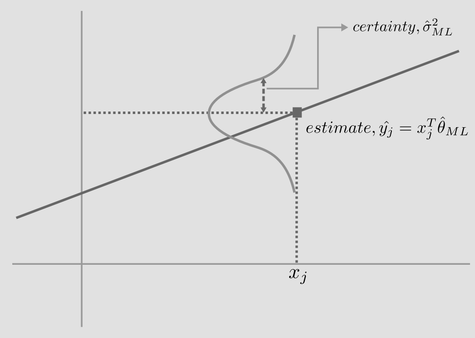

Authors: Shan Ali, Josh Artmann, and Maryam Blooki

In this lecture we dove into guassian distributions and expanded on what we know about regressions and how they are built. The following paragraphs will cover gausian distributions, maximum likelihood esstimation, and additional topics we find relavent and fun!

A probability distribution is a function of all the probabilities of all possible outcomes of a stochastic process. The gaussian distributions, commonly referred to as the normal distribution, is the most common probability distribution and at the intersection of statistics, modeling, and machine learning. 

The gaussian distribution is a means to model the uncertainty of a continuous variable from $−\infty$ to $+\infty$. It is defined by the mean and standard deviation of a population or sample. The distribution is centered around the mean and the width is a function of the standard deviation, sigma. An important feature of the distribution is it encompasses all the possible scenarios of a stochastic process, thus the sum of all the probabilities (i.e. the area under the curve) is equivlant to 1. Another feature of the curve is all probabilities are possible, thus the probability of any outcome is positive and never 0. The distribution can be modeled by this function and governed by these conditions:

$N(x|\mu,\sigma^2) = \frac{1}{(2\pi\sigma^2)^{1/2}}exp\{\frac{-1}{(2\sigma^2)}(x-\mu)^2\}$

$\int_{-\infty}^{+\infty} N(x|\mu,\sigma^2) > 0$

$N(x|\mu,\sigma^2) dx = 1$

Beyond the simple space, the gaussian distribution can live in multidimensional spaces as the multivariate gaussian. The multivariate gaussian builds on the single variate gaussian function but applies matrix notation to embed multivariate information. The important distinction is the center is defined by a vector of variate means and the width is a function of a D x D covariance matrix, which captures the inter-variate and intra-variate standard deviation. The modeled is defined as thus:

$N(x|\mu,\Sigma) = \frac{1}{(2\pi)^{D/2}}\frac{1}{|\Sigma|^{1/2}}exp\{\frac{-1}{2}(x-\mu)^T\Sigma^{-1}(x-\mu)\}$

$\mu$ -> vector mean

$\Sigma$ -> covariance matrix (DxD)

Applied, we can determine the likelihood a sample fits in a specific gaussian distribution, which can be used to determine the mean and standard deviation of the sample. Quantitatively, the likelihood a sample fits a specific gaussian distribution is product of all the probabilities of each sample value and is modeled as:
 
**Likelihood of observing given sample** $= \prod_{n=1}^N  N(x_n|\mu,\sigma^2)$

## Principle of Maximum Likelihood

The principle of maximum likelihood for linear regression is one of many methods we can use in order to choose the best line fit for our data.  Other methods include OLS (ordinary least squares), Ridge regression, and many others.  The first step when using maximum likelihood is to is to choose the probability distribution believed to be generating the data.  This of course depends on the data but the most common distribution is a gaussian or normal distribution.  For the purposes of MLR we are generally interested in a joint normal probability distribution which can be represented as $|2\pi\sum|^{-1/2}e^{-1/2{(y-\mu)}^T\sum^{-1}(y-\mu)}$ where $\sum$ is the covariance matrix of nxn dimensions and y and $\mu$ are vectors of n length. Before finding the best fit line we must make some assumptions: We assume each label, $y_i$, is gaussian distributed with mean, $x^T_i\theta$ and variance, $\sigma^2$. Or that $\overbrace y_i = x^T_i\theta$. Then take the log because it gets rid of the exponents and gives us a monotomically increasing function that is easy to maximize. You then take the derivative and set equal to zero to get the best estimate for that point then plot those $\overbrace y_i$ and $x_i$ for the total probability distribution.  A visualization of this can be seen attached with attached images.  

*Reference Attched MLR Output Image

## Red Box: Describes the Source of Variance in the Model

**SS = Sum of Squares**  

*SS Total: Sum All (Y - Y bar)^2*  

*SS Residual: Sum All (Y - Y predicted)^2*  

*SS Model: Sum All (Y Predicted - Y bar)^2*  

**DF = Degrees of Freedom**

*Total DF: N-1*

*Model DF: (Number of Predictors or Independent Variables + 1 for Intercept Term) - 2*

**MS = Mean Squares**
*MS Model: SS Model - DF Model*
*MS Residual: SS Residual - DF Residual*

**Model**
*Variance Explained by the Independent variables in the Model*

**Residual/Error:**
*Variance Not Explained by the independent Variables in the Model*

## Blue Box:

**F(3,70):**
*MS Model / MS Residual*

**Prob > F:**
*P Value Associated with F(3,70)*

**R Squared:**
*Porportion of Variance in the Dependent Variable Which Can Be Predicted from the Independent Variables*
*SS Model / SS Total*

**Adj R Squared: Adjusted R Square**
*As Number of Predictors Increase, Each Predictor Will Explain Some of the Variance in the Dependent Variable by Chance*
*1 - ((1 - R Squared)(N - 1)) / (N - # of Predictors - 1)*

**Root MSE: Square Root of MS Residual**

## Green Box:

**Coefficient Column:**
*Relationship Between Dependent Variable and Independent Variables*
*Amount of change in Dependent Variable, Given a 1 Unit Increase in a Specific Independent Variable, Holding All Other Variables Constant*

**Standard Error:**
*Determines Whether Parameter is Statistically Different from 0*
*Used to Determine Confidence Interval for Specific Parameter*

**T-Value:**
*Coefficient / Standard Error*

**P-Value:**
*2 Tailed P-Value Tests Null Hypothesis that Coeficient is 0*
*P-Values < .05 = Statistically Significant*

**95% Confidence Interval:**
*Range of Values That Actual Population Value of the Independent Variable Might Be*
*Coeficient Is Not Statistically Significant, If Interval Includes 0*
