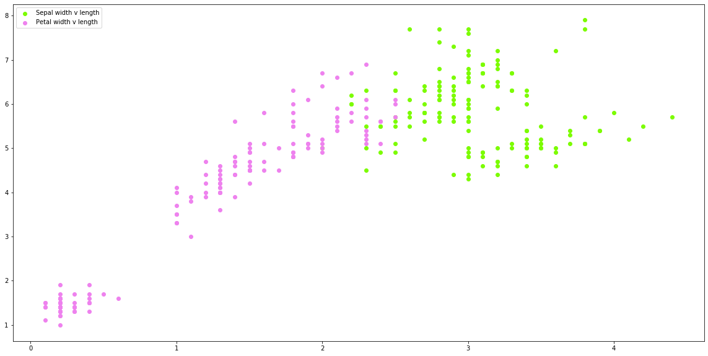
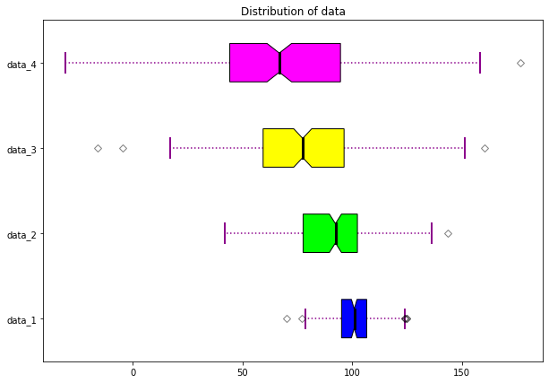

Authors: Patricia Schutter, Katherine Zingerman, Jenny Robinson. ([PDF](../../static/a-10-dp.pdf))

In this lecture, we reviewed the importance of preprocessing data. We all know that retrieving and working with data can come with many issues, and it's impossible to get reliable results without cleaning and analyzing our data before we get to work. 

## Potential Issues with Data

**1. Quantity**
- Do we have enough data to get a reliable result? The amount of data needed depends on the nature of the problem. 

**2. Quality and Adequacy**
- Do the current data form and data features answer the questions we are asking?

**3. Labels**
- How is the data organized, and is it consistent?

**4. Big Data**
- How can we find the signal in all the noise? How can we keep track of large volumes of fast data collection?

# Why Preprocess Data?

The main idea behind preprocessing data is to ensure speed and accuracy of our results. We only want to use the data that is needed for the questions asked, and we want to reduce/eliminate all possible errors that could stem from inconsistency, incompleteness, noise, or duplicate data. These issues are inevitable because data collection is not perfect. Perhaps the data has null values or default values that aren't thoughtful. The data is likely to come from a variety of sources in different formats, and it always contains some degree of noise. By preprocessing our data, we can greatly reduce the effects of these issues and enhance the accuracy of our predictions or insights. 

# Preprocessing Steps:
To preprocess the data efficiently, it's helpful to go through each step below to ensure we handle all aspects of the data. These steps are not always linear, and repeating steps is not uncommon! If you aren't spending at least 75% of your time on this part, you may not be paying enough attention to preprocessing.

**1. Data Cleaning**
- Basic data cleaning is absolutely necessary no matter how small or large the task. Without cleaning the data, you will almost always encounter errors (whether they occur in the code or the results). Some data might look very clean and standardized, especially if it comes from a warehouse, but you should still do sanity checks and look for consistency. 

**2. Exploratory Data Analysis**
- I'm sure most (or all) of us have experienced an obnoxious python error that will not go away no matter how you change your code, only to find out that there's a null row or an "int" value where there should be a string. Maybe you've run a linear regression that gave you a huge error because you ignored a single outlier. These mistakes are made from skipping this step! Save yourself a lot of time and make sure to explore your data before moving forward with the task.

**3. Data Reduction**
- Redundant data or overload of data not only slows down analytical processes, but it can also interfere with proper analysis. For instance, if there are too many features in our model, overfitting can occur which will lead to larger errors. 

**4. Data Visualization**
- This is one of the most overlooked steps in data preprocessing! It can be tempting to jump right into the analysis, but if you don't have a solid understanding of the data you're dealing with, you will waste time fixing errors that could've been avoided. 

# Preview Data

Prior to cleaning the data, it is important to take the time to get an overview of the data that you will be cleaning, to better understand how the data is in its current state and what should be done to improve the quality of the data. There are a few key performances that one should do to get a better feel for the data. These procedures include: getting summary statistics, getting a count of missing values, understanding the datatypes associated with the data, and seeing the data through a visualization tool such as a boxplot or scatterplot.

# Pre-processing in Scikit-learn


```python
#import basic necessary modules 
import pandas as pd    
import numpy as np 
from sklearn.datasets import load_iris
from sklearn.linear_model import LinearRegression
from sklearn.preprocessing import StandardScaler
from sklearn.preprocessing import MinMaxScaler
from sklearn.model_selection import train_test_split
import matplotlib.pyplot as plt

#import iris standard dataset 
iris = load_iris()

#transform scikit learn dataset to pandas dataframe and set columns & rows
iris = pd.DataFrame(iris.data, columns=iris.feature_names)

#create train and test sets 
y = iris.iloc[:, 0]
X = iris.iloc[:, 1:]
X_train, X_test, y_train, y_test = train_test_split(X, y, test_size=0.25, random_state = 50)

# #create a scaler on the training data 
# #calculates mean and st.dev on training set to reapply the same transformation on the testing set
scaler = StandardScaler().fit(X_train)
scaler.mean_ #calculates mean
scaler.scale_ #determine scale of data 

# #use scaler to transform new data in same way as X_train
X_test_transformed = scaler.transform(X_test)

# #scaling features to the range [0,1]
min_max_scaler = MinMaxScaler()
X_train_minmax = min_max_scaler.fit_transform(X_train)
```


```python
#create a scaler on the training data 
#calculates mean and st.dev on training set to reapply the same transformation on the testing set
scaler = StandardScaler().fit(X_train)
scaler.mean_ #calculates mean
scaler.scale_ #determine scale of data 

#use scaler to transform new data in same way as X_train
X_test_transformed = scaler.transform(X_test)

#scaling features to the range [0,1]
min_max_scaler = MinMaxScaler()
X_train_minmax = min_max_scaler.fit_transform(X_train)
```


```python
from sklearn.preprocessing import scale

#fit data to a Gaussian distribution 
X_scaled = scale(X_train) 

#set the mean = 0
X_scaled.mean(axis=0)

#set st.dev = 1
X_scaled.std(axis=0)
```


    array([1., 1., 1.])


```python
from sklearn.preprocessing import OrdinalEncoder
#encoding categorical features to numerical features
encode = OrdinalEncoder()
Z = [['male', 'from US', 'uses Safari'], ['female', 'from Europe', 'uses Firefox']]

#base categorical variables on given dataset 
Z = encode.fit(Z)
encode.transform([['female', 'from US', 'uses Safari']])
```


    array([[0., 1., 1.]])


# Scatter plot visualization


```python
# create visualization where you can see the distribution of data and understand how independent and dependent
# variables interact with each other. Scatter plots are used for a variety of predictive modeling techniques to see
# how data behaves so it is very important to understand the relationships in the data. 

import pandas as pd    
import numpy as np 
from sklearn.datasets import load_iris
from sklearn.model_selection import train_test_split
import matplotlib.pyplot as plt

#import iris standard dataset 
iris = load_iris()

#transform scikit learn dataset to pandas dataframe and set columns & rows
iris = pd.DataFrame(iris.data, columns=iris.feature_names)

#create x and y to plot 
y1 = iris['sepal length (cm)']
X1 = iris['sepal width (cm)']

y2 = iris['petal length (cm)']
X2 = iris['petal width (cm)']

#create scatter plot 
plt.figure(figsize=(20,10)) #set figure space
plt.scatter(X1, y1, c = 'lawngreen', marker = 'o', label = 'Sepal width v length')
plt.scatter(X2, y2, c='violet', marker='o', label='Petal width v length')
plt.legend(loc='upper left')
plt.show()
```





# Box plot visualization


```python
# create box plots to see the distribution of the data and understand the maximum, minimum, median, averages, outliers, 
# ranges of the multiple datasets in a single figure plane. These are very important to create when initially looking 
# at data to understand basic features of the data. It also shows the different quartile breakdown of the data and 
# shows the 25th, 50th, and 75th quartiles. 

# Creating random dataset 
np.random.seed(10) 
  
data_1 = np.random.normal(100, 10, 200) 
data_2 = np.random.normal(90, 20, 200) 
data_3 = np.random.normal(80, 30, 200) 
data_4 = np.random.normal(70, 40, 200) 
data = [data_1, data_2, data_3, data_4] 
  
fig = plt.figure(figsize =(10, 7)) 
  
ax = fig.add_subplot(111) 
  
# Creating axes instance 
bp = ax.boxplot(data, patch_artist = True, 
                notch ='True', vert = 0) 
  
colors = ['#0000FF', '#00FF00',  
          '#FFFF00', '#FF00FF'] 
  
for patch, color in zip(bp['boxes'], colors): 
    patch.set_facecolor(color) 

# changing color and linewidth of whiskers 
for whisker in bp['whiskers']: 
    whisker.set(color ='#8B008B', linewidth = 1.5, linestyle =":") 
    
# changing color and linewidth of 
# caps 
for cap in bp['caps']: 
    cap.set(color ='#8B008B', linewidth = 2) 
    
# changing color and linewidth of 
# medians 
for median in bp['medians']: 
    median.set(color ='black', linewidth = 3) 
    
# changing style of fliers 
for flier in bp['fliers']: 
    flier.set(marker ='D', color ='#e7298a', alpha = 0.5) 
      
# x-axis labels 
ax.set_yticklabels(['data_1', 'data_2','data_3', 'data_4']) 
  
# Adding title  
plt.title("Distribution of data") 
  
# Removing top axes and right axes 
# ticks 
ax.get_xaxis().tick_bottom() 
ax.get_yaxis().tick_left() 
      
# show plot 
plt.show(bp) 
```





# Data Cleaning

Data is often given with missing values such as in the table below.

[](https://i.imgur.com/AHHh4I6.png)


## Step 1: Dealing with Missing Values (imputation)

**1. Understand why the data is missing**

- Missing at random (MAR)- missingness is random within subgroups
    - Example: From the table above, it may look like the income variable was missed among many people, but if we dive deeper into the role of these people, it is missing for all senior level roles. (While it is missing for an entry level role as well, it missing entirely for all senior roles.) 

- Missing completely at random (MCAR)- These values are missing completely due to randomness.            
    - Example: There is no data for line 9. This could be because the survey was lost. Therefore, these values are missing completely at random.

- Missing not at random (MNAR)- These values tend to be missing because of the value themselves.            
    - Example: In line 8, the entry level education person did not share their income, perhaps because it was a low value.   

Data that is classified as missing at random creates an element of intuition that must be thought through:
> Why is this data missing for this particular category? 

> Does this missing data tell us something?

<b>2. What to do about missing values</b>
    - Ignore rows with missing data
    - Replace by mean, median, or constant for all missing values
    - Use the mean or median from the rows with similar conditions for each missing value
    - Turn the row into a binary response: whether the question was answered or not


## Step 2: Outliers

[](https://i.imgur.com/C9vVrPg.png)

Outliers are data objects that lie outside of the majority of the other data points. It is important to detect outliers in data as they can destory the quality of the data you are working with. When working with data, it is important to understand the type of problem to know whether your data is based on outliers (fraud) or not.

<b>Some strategies for dealing with outliers include:</b>
    - Dectecting them and tossing them out
    - Changing the value of outliers to make them less extreme

## Additional Resources
- [Missing Values](https://www.youtube.com/watch?v=P_iMSYQnqac)
