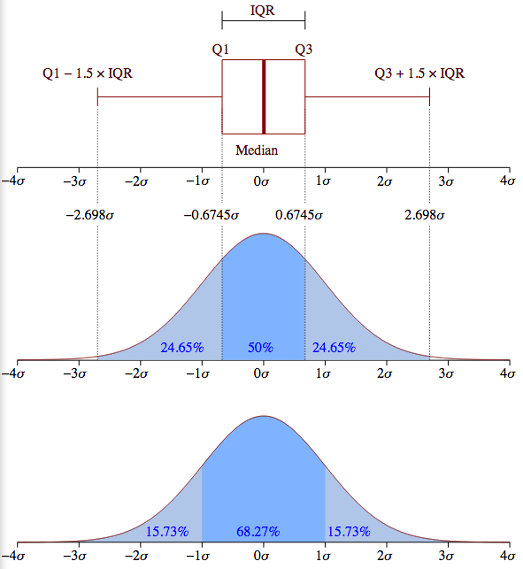
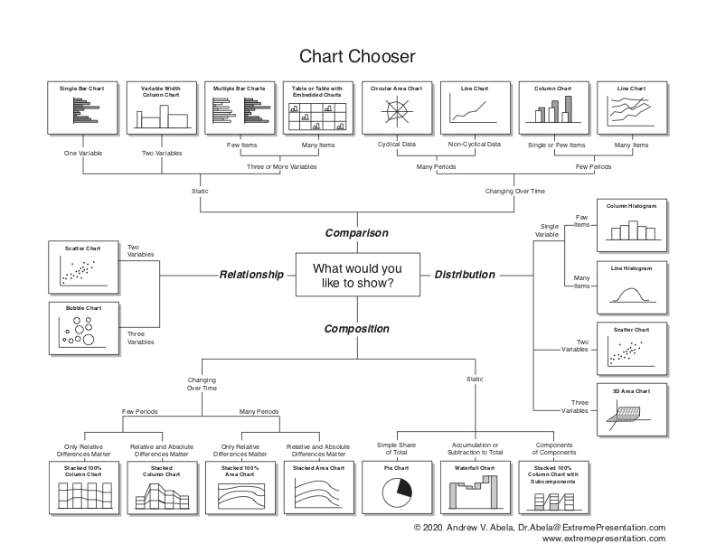

**Authors:** Vikram Seth, Steve Sohn, Xinmeng Song. ([PDF](../../static/a-11-outliers.pdf))

## Overview of Lecture

The lecture first introduced several common data issues, and then explained that the solution is to use data pre-processing. Data pre-processing is a very frequently used process in daily data analysis. 

Then it introduced how data cleaning is used and how to process missing values and outliers. Many algorithms used in feature selection and feature extraction are introduced in data reduction methods.

Our note will go over the following topics:

- Data Cleaning
- Exploratory Data Analysis
- Data Reduction
- Data Visualization

## Data cleaning

### Dealing with Missing Values

There are many reasons for missing data. For example, it may be because the respondent forgot to answer the question, or the questionnaire is too long and the questionnaire is too long, and the survey may not be completed. There may also be a problem with the recorded equipment or network error. There are several common ways to deal with missing values:

- Ignore the record or attribute(s)
- Fill in missing values

### Handling Outliers

Outliers are data objects with characteristics that are considerably different than most of the other data objects in the data set. For univariate detection of outliers, there is a simple and effective way: to use boxplot. Note that the outliers (the + markers in your plot) are simply points outside of the wide [(Q1-1.5 IQR), (Q3+1.5 IQR)] margin below.

### Huber Loss

Instead of identifying and eliminating outliers, we can use methods that are not as affected by outliers.

One of these methods is Huber Loss (1964).

Easiest way to explain Huber Loss would be that it is like a combination of Mean Squared Error and Mean Absolute Error, where it is similar to MSE (quadratic) for small numbers and similar to MAE (linear) for larger numbers. It is expressed by the following:

Refer to Additional resources for comparisons with other loss functions.

### Python Outlier Detection (PyOD)

PyOD includes over 20 outlier detection algorithms and is well-documented. 

For a tutorial and a list of the algorithms visit [here](https://www.analyticsvidhya.com/blog/2019/02/outlier-detection-python-pyod/) or refer to other links in the additional resources section.

## Exploratory Data Analysis/Data Visualization

Data exploration and data visualization are generally inseparable. There are many graphical choices faced in visualization. There is a chart selection diagram created by Dr. Andrew Abela that should help you pick the right chart for your data type.

First, we need to understand that data usually contains five related relationships: composition, comparison, trend, distribution, and connection.

The composition is mainly concerned with the percentage of each part of the whole. If the information you want to express includes: "share", "percentage" and "what percentage is expected to reach", then you can use a pie chart;

Comparison can show the order of things—is it the same, or is one more or less than the other? "Greater than", "less than" or "approximately equal" are all keywords in a comparative relative relationship. At this time, bar graphs are preferred;

Trend is the most common kind of time series relationship. It is concerned about how data changes over time. The weekly, monthly, and yearly trends are increasing, decreasing, fluctuating up and down or basically unchanged. At this time, it is better to use line graphs. The trend of the performance indicators over time;

Distribution is concerned with how many items are included in each value range. Typical information will include: "concentration", "frequency" and "distribution", etc. At this time, bar graphs are used; at the same time, it can also be displayed on a map based on geographic location data Different distribution characteristics;

The connection is mainly to check whether the two variables express the model relationship we expect to prove. For example, the expected sales may increase with the increase of the discount rate. At this time, it can be displayed with a bubble chart to express "related to... ", "Growing with...", "Differing with..." the relationship between variables.

## Data reduction

The lecture provides a detailed introduction to data reduction related technologies, and also mentions some technologies of Data transform. Box-cox is also a common conversion technology.   
   
When considering reducing data, one has two primary options:   
**1) Reducing the number of observations**     
**2) Reducing the number of features**   
   
Beyond doing this, one can change the "resolution" of the data, which means changing the extent to which each data point contains information. A good example of this would be decreasing the number of pixels in an image.   
   
   
When considering decreasing the number of observations, there are several things to consider. If one has a simple mode, they may only need a certain amount of observations/data to fit it, and there will be diminishing marginal returns to adding more data to train the model. If there is *no collinearity* between the features of the data set, a good rule of thumb is to require 10 observations per feature. If there is variable interaction, then you will require more data points.   
    
If you are considering dropping many data points, then you need to understand the fundamental principles behind *sampling theory*. For example - you do not need to sample all 350 million respondents of the United States in order to have a *representative sample* of the population. You could achieve this sample accuracy by ensuring certain qualities are met (which can be found [here](https://www.sciencedirect.com/topics/social-sciences/sampling-theory)). 

Compressed Sensing - a situation where it is possible to get a good model, despite having *less observations than the number of features*.   
   
In order to achieve a good model with this theory, you have to make two assumptions of the data:   
**1) Sparsity of Signals**   
**2) Incoherence**   
   
While this theory predominatley relates to image processing, the information can best be summarized in these [slides](https://www.slideshare.net/ahmed_nasser_ahmed/introduction-to-compressive-sensing-43183358). 

If you are considering removing features from the data in order to simplify it, an easy, and somewhat obtuse, assumption to have would be that you are removing information that is useful when removing features. There are many considerations here:   
1) Less variables can lead to more interpretable models   
2) Redundant Features can have collinearity - which lead to decreased return in the complexity VS information tradeoff.    
    
The "curse of dimensionality" also exists - where with increased levels of dimensions, as given by increased number of features, results in the lower ability for an indvidual to make inferences from the data, and or model results. 

## Addtional Resources

**Data Cleaning / Pre-Processing / Outliers** 

Box Plots and Outlier Detection using Python

https://statinfer.com/104-3-5-box-plots-and-outlier-dectection-using-python/

Boxplots in matplotlib: Markers and outliers

https://stackoverflow.com/questions/17725927/boxplots-in-matplotlib-markers-and-outliers

Box Cox Transformation

https://www.statisticshowto.com/box-cox-transformation/

5 Regression Loss Functions All Machine Learners Should Know

https://heartbeat.fritz.ai/5-regression-loss-functions-all-machine-learners-should-know-4fb140e9d4b0

Huber Error| Loss Functions

https://medium.com/@gobiviswaml/huber-error-loss-functions-3f2ac015cd45

Focus on PYOD

https://rsipvision.com/ComputerVisionNews-2019March/18/

An Awesome Tutorial to Learn Outlier Detection in Python using PyOD Library

https://www.analyticsvidhya.com/blog/2019/02/outlier-detection-python-pyod/

**Data Visualization**

The Extreme Presentation(tm) Method

https://extremepresentation.typepad.com/blog/2006/09/choosing_a_good.html

**Data Reduction**

Sampling Theory

https://www.sciencedirect.com/topics/social-sciences/sampling-theory

Introduction to compressive sensing

https://www.slideshare.net/ahmed_nasser_ahmed/introduction-to-compressive-sensing-43183358

