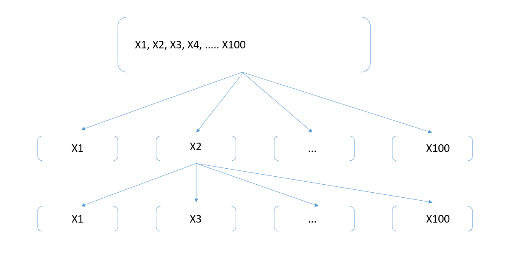

Authors: Matthew Streichler, Khoi Tran, Sunny Vidhani. ([PDF](../../static/a-12-reducing-features.pdf))
### Summary of Lecture
In this lecture, we were introduced to two methods of reducing the number of attributes or features in a given subset – Feature Selection and Feature Extraction (“Feature Engineering”). We go through the processes for each method and different approaches within each method to determine a subset of the original dataset. In class, we used an example of a dataset with 100 original features to visually understand how each of these methods interact with the dataset. We will be referencing this example below.

### Feature Selection
Feature Selection, at a high level, is a process where you select a subset of the original features, without manipulating or changing them, which contribute most to your predictive model. With the example of 100 original features, how do you determine which features to use for the subset? There is an endless amount of choices. With the decision to either “keep” or “don’t keep” these features, there are $2^{100}$ possible choices. With that many possibilities, we can use a method coined “NP-hard”, meaning it tries out all possible combinations and produces features that give the predictive model the best results. However, the NP-hard method is too hard to find guaranteed optimal solutions, very time consuming, and computationally expensive, so we use heuristic approaches (no guarantee if it’s optimal but gives a reasonable answer) which are not as exact, but much quicker to execute. The three heuristics approaches are Filtering, Wrappers, and Embedded.

***Filtering***

The filtering method uses an intrinsic quality measure to determine which features to keep. In other words, it uses metrics such as $R^{2}$, RMSE, correlation, etc. to determine which features to include. For example, out of the 100 original features, we filter through $x_{1}$-$x_{100}$ and decide that we should use $x_{1}$, $x_{3}$, $x_{34}$, $x_{55}$, and $x_{80}$ in our subset. If we decided to use correlation as our metric, why wouldn’t we simply pick the top five features with the highest correlations? We cannot do this as it poses a problem for our subset. It actually doesn’t say much when picking the top five correlated features. This is because the value added from adding the second largest correlated feature to a subset with the largest correlated feature is minimal. Rather, adding a feature that has a lower correlation may add additional value that the largest correlated feature doesn’t include. This is because most of the effect from the second largest correlated feature is already included in the largest correlated feature. Additional filtering methods one could use are t-stat, chi-squared, and selecting low variance features.

***Wrappers***

Unlike the filtering method, the wrappers method uses an extrinsic evaluation to determine what features are useful for a subset of the original dataset. For each of the 100 features, we can either use Forward Inclusion, Backward Elimination, or Stepwise approaches to determine which features to include. If you believe that most of the features are not useful, then a Forward Inclusion approach is best to use. In this approach, you would construct a predictive model on each of the features individually and pick the feature that performed the best ($x_{2}$) on the test dataset. Next, you would want to determine which features add the most value to the model while still using the feature you just added. You would repeat the same process, however, instead of modeling each feature individually, you would model each feature with the first chosen feature ($x_{2}$ + $x_{1}$, $x_{2}$ + $x_{3}$, $x_{2}$ + $x_{4}$, …, $x_{2}$ + $x_{100}$) and then pick which of these performs the best. You would continue this process until you have reached a point where the marginal value added to the model is not substantial.

If you believe that most features in the dataset are useful for your predictive model, you would use Backward Elimination. For this approach, you would include all 100 features at first and recursively remove the feature that performs the worst in each iteration. Stepwise is the hybrid of these two options in which you are able to add or remove features at any step of this process.

***Embedded***

With the embedded approach, we would use a predictive model where feature selection is already built (LASSO, Decision Trees, etc.). This method is appropriate to use when some features play a secondary role and would not be meaningful if they were in the primary dataset.

### Feature Extraction
The second method when reducing the number of attributes is Feature Selection, or Feature Engineering. For this method, we would use derived features, not the original ones. To obtain these new derived features, we would simply determine which approach we wanted to use. There are many different methods to reach an answer, however, they all fall into one of four buckets – Linear-Supervised, Linear-Unsupervised, Non-Linear-Supervised, Non-Linear-Unsupervised. Principal Component Analysis (PCA) falls into the Linear-Unsupervised bucket and is the most basic method. Within the Linear-Unsupervised bucket, you could use either Fisher’s Linear Discrimination, which is a classification method, or Canonical Correlation, a regression method. Within Non-Linear-Supervised, you could use non-linear discriminant analysis (MLP) and with a Non-Linear-Unsupervised approach, you can use Principal Curves, T-SNE, Sammon's Map, or Kohonen's SOM.

***PCA***

Principal Component Analysis (PCA) reduces the dimensionality of the original dataset by transforming a large set of variables into a smaller one while still retaining all the information in the original dataset. It finds the best “subspace” that captures as much data variance as possible. What if you would like to find the direction where the data is more spread out compared to other distributed data points while using PCA? You would look at the covariance matrix, or the eigenvectors, and the eigenvalues. After obtaining the eigenvalues, you would order them from largest to smallest. The largest eigenvalue determines the direction of the data spread as it has the greatest influence over all the other data points. If you would like to go deeper into this, you can look at the total variance (sum of all eigenvalues) and determine what percentage of the variance that your model represents. Say, for example, you have four data points with eigenvalues equal to 8, 1.5, 0.5, 0 (sum of eigenvalues = 10). If you were to pick one feature, the percent of variance retained in your model would be 80% (8 / 10). If you were to pick two features, the percent of variance retained in your model would be 95% ([8+1.5] / 10). With three features, the percent of the variance retained would be 100% ([8+1.5+0.5] / 10). With all four features, the percent of the variance retained would still be 100% ([8+1.5+1.5+0] / 10). This would give us insight because by only using three features, we retain all the variance in the model without having to add the fourth feature.
