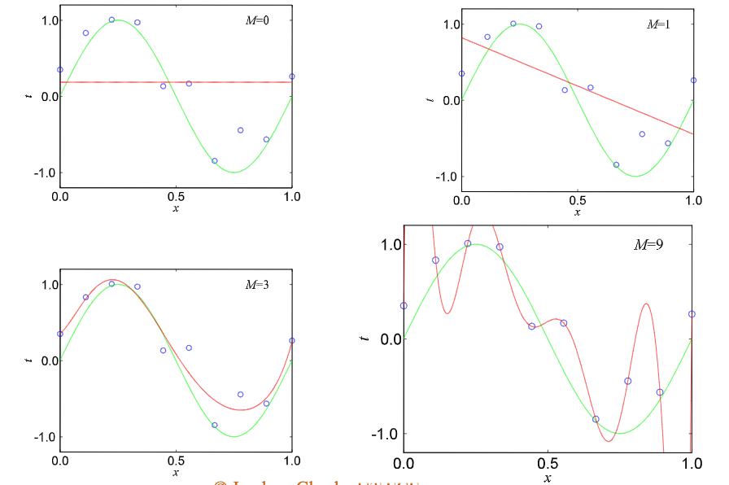

Authors: Benjamin Deutsch, Emah Eguche, Tairan Deng 

## Lecture Content

Sept 16th lecture was mainly about the following topics;

1. Regularization and overfitting issues
2. Parameter/component evaluation
3. Bias-Variance dilemma

### Regularization & Overfitting

Polynomial models of higher dimension are not always appropriate when dealing with predictive modeling. For example: $X^{M}$ given, $M=3$ and $M=9$. When $M=9$, the model is complicated and is said to overfit, meaning the model exactly replicates of all training data. This is not useful because it is a model tailor made for that data set and will have limited if not any predictive power with respect to sampling changes in the data.  Even the M=3 model does not have execellent prediction on the training data, still it can be said is a better option because it  it offers more flexbility for alternative sample data set and maintaining some predictive powers. Underfitting occurs with ridge function such as M=1 where the model output can has no motion to accomodate the datas inner points. 

See Below:

$$ COST = MSE + \lambda * Penalty(f) $$

Generally speaking, lower order polynomial works better on lower data sparsity and higher polynomial model are good for high sparsity of data. In order to facilitate the alternatives to the general rule, we introduce a penalty which reacts to the weights of the particular data, in a process called regularizatrion. This "Cost" as referred to above is the result of the MSE given by the dataset, the $\lambda$ or "tradeoff" multiplier and the "Penalty" function which is empirically chosen.    
It should be noted that weight 0 is not included in the penalty calculation since Penalty(f) is sum of weight from 1 to M. The Mean Squared Error is the mean squared value of residuals from the models data fitting regression plot. Again as a reminder the purpose of this standardization is to create a model with certain fit and smaller weights are normally preferred.

As a rule of thumb higher data complexity of a data set is usually referred to data sets with higher collinearity, meaning, componet values will be indicators for other componet values. In english column values will rely and have results because of other columns values. This is an issue as it amplifies the effects of these componets in the models practice. And so, given this higher collinearity will usually result in higher penalties. The issue here is mitigating that effect. So enters two types of regression modelings; Ridge,

$$\sum_{M}^{i=1} w_{i}^{2}$$

And Lasso,

$$\sum_{M}^{i=1} \left \|w_{i} \right \|$$

Each of these has machinizations built in for handling different data set types. 

Lasso penalty is absolute value of $\w, weights are linear ("V" shaped) given the componet volume of the set. Giving this the ability to drop componets to zero. While Ridge penalty is sum squared of weights, which increases exponentially as the component weights increases  'U' shape curve. Unbiasing the small weights aganist the larger weighted classes.

Without regularization, the weights would be very high value and create a high cost.
$$E(w) = \sum_{N}^{n=1} \left \{ w^{T} \phi(x_{n}) - t^{n} \right \}^{2} + \frac{\lambda}{2}\left \| w \right \|^2$$

Therefore, we prefer to use Ridge for higher complexity models and Lasso is a better soltuion for low complexity models.

In the graph of Ridge and Lasso lambda comparison, we can see differences in the models on optimizing parameters. The degree of freedom is inversely related to lambda. After fitting two models with cross validation and finding out the best lambda for prediction, we can see in the Lasso model the best fitting lambda excluded 3 parameters of the model. In practice if you have a lot of parameters, use Lasso to figure out which parameters are noisy and drop them. Use Ridge to manage a colinarity problem.

### Quiz review
Trick question: A dataset is devided half & half for set A and set B. Run OLS model on set A and with good luck we found the optimal parameter vector, i.e. Beta. Then if we use the optimal parameter model for dataset A and B, what MSE would we expect? The right answer is MSE of Dataset B will be similar to that of Dataset A. The error is coming from both A and B, then the error is evenly distributed between A and B. Under optimal parameter, the residuals are from the model, not from lambda or penalty. In the model fitting process, A and B shared same amount of errors and will return similar MSE.

MLR model question.

1. Independent variables are measured error-free, so there is no noise associated with them.

2. Independent variables are independent from each other. 

Variables can still have errors even they are independent from each other and noise will exist due to errors. Removing collinearity of variables will not reduct errors and noise.

### Bias-Variance Dilemma
$$E[L] = \int \left \{ y(x) - h(x) \right \}^2 p(x)dx + \int \int \left \{  h(x)- t \right \}^2 p(x,t)dx dt$$

The error of a model has 2 components; controllable error depending on the Probability Density Function of x and the uncontrollable independent noise. In the senario mentioned in class, 3 models fit differently when X is in different ranges. For a certain range of X, a certain model will be the best fit. However when X is randomly drawn, different model fits will produce different level of errors. The purpose of the PDF, P(x), is to reduce the error incurred due to randomness of x value in the model, which is represented by y(x)-h(x).

For the independent noise part, it can not be optimized because of it is cause by x and t, as zero mean noise.In the ideal case, we want to totally eliminate the error caused by probability density of x and the only residual error would be the zero mean noise.

$$E[t/x]=h(x)$$

## Addtional Resources

### Regulation and Overfitting

More information on regularization and overfitting in this article: https://medium.com/greyatom/what-is-underfitting-and-overfitting-in-machine-learning-and-how-to-deal-with-it-6803a989c76

### Bias-Variance Dilemma

More information on the bias-variance tradeoff in this article: https://towardsdatascience.com/understanding-the-bias-variance-tradeoff-165e6942b229

More information on the bias-variance tradeoff in this video: https://www.youtube.com/watch?v=EuBBz3bI-aA&feature=emb_title
