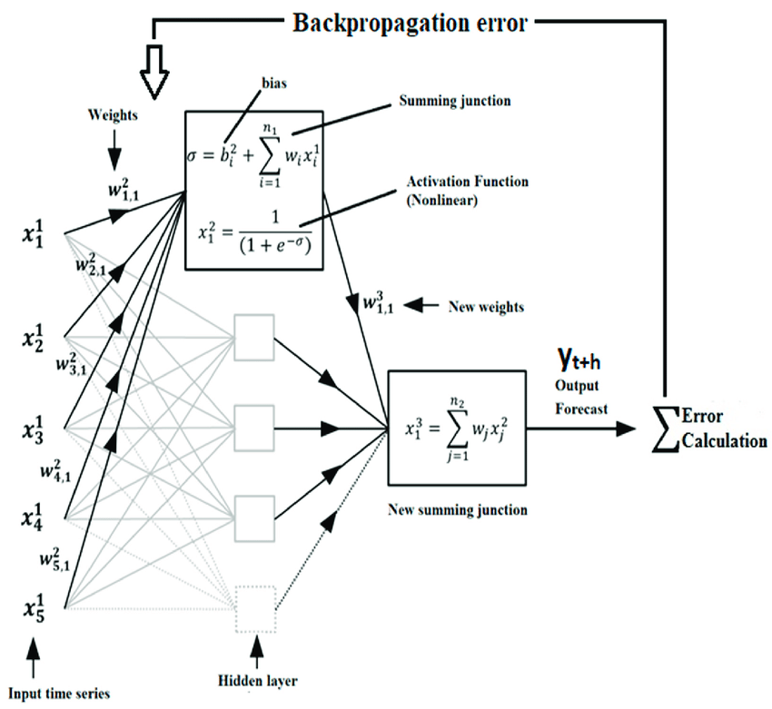
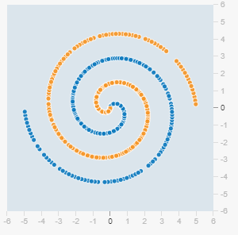
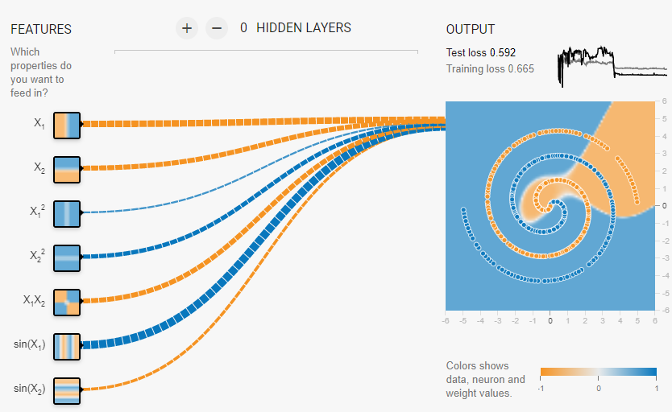
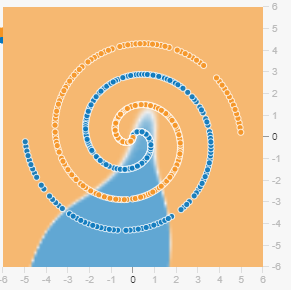
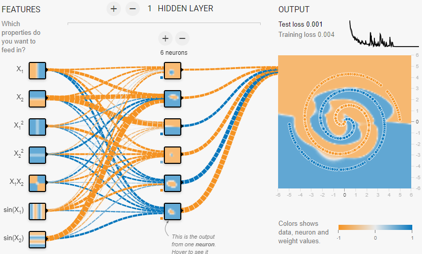
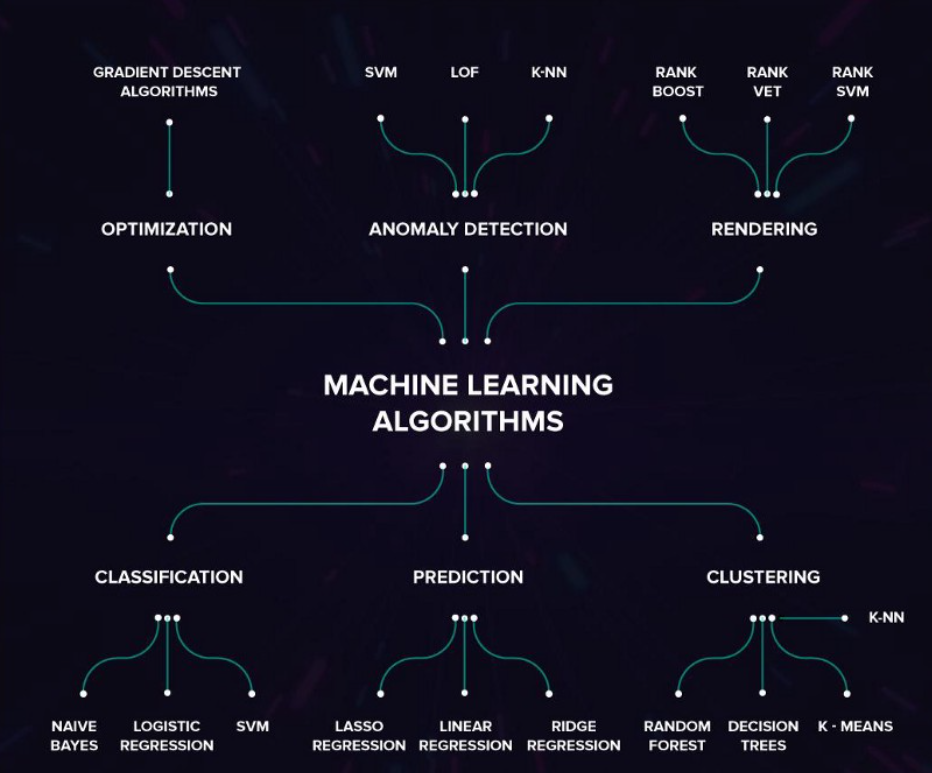
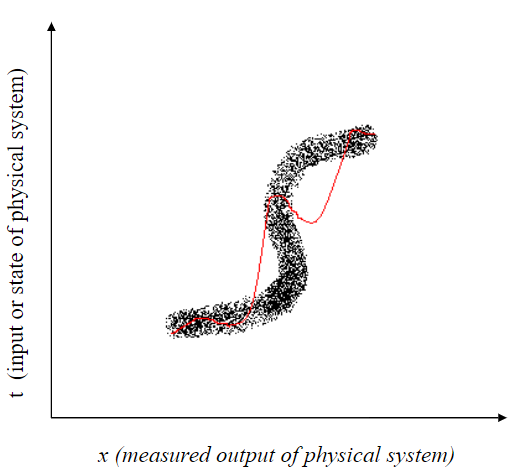

Authors: Jason Petri, Jordan Pflum, Immanuel Ponminissery

## Overview of Lecture

During lecture, we first went over the backpropogation algorithm. This discussion followed the discussion of the intuition behind backpropogation from the previous class. Next, there was a discussion about model complexity and adjusting comlexity for MLPs. We then discussed Deep Learning and went over Facebook's Deepface paper on a high level. The class concluded with a discussion about choosing methods to solve problems and the issues of modeling inverse problems.

These notes will go over the following topics:
* Backpropogation algorithm
* Complexity discussion of MLPs
* Deep Learning
* Choosing Machine Learning method
* Issues with modeling inverse problems

## Backpropogation Algorithm

The backpropogation algorithm is split into two parts: the forward pass and the backward pass. One of the most tricky aspects of explaining the algorithm is the notation itself. The discussion below is a general outline of the algorithm:

For each input vector x, the activation of the hidden units is calculated as shown:

$$
\begin{aligned}
h = \sigma(x\times w^1)
\end{aligned}
$$

The activation of the output units is calculated as shown:

$$
\begin{aligned}
a = \sigma(h\times w^2)
\end{aligned}
$$

The error at each output and the deriatives of the activations are then calculated:

$$
\begin{aligned}
e^2 = a-t
\end{aligned}
$$

$$
\begin{aligned}
d^2 = a(1-a) e^2 \eta
\end{aligned}
$$

The error from the output is passed back to the hidden layer and the weights are adjusted as shown below:

$$
\begin{aligned}
d^1 = h(1-h) w^2 d^2 \eta
\end{aligned}
$$

$$
\begin{aligned}
w^2 = w^2 + (h \times d^2)
\end{aligned}
$$

$$
\begin{aligned}
w^1 = w^1 + (x \times d^1)
\end{aligned}
$$

An illustration of neural network with the backpropogation algorithm is shown below:

## Complexity discussion of MLPs

### Model Complexity for MLP

The complexity of a neural network is dependent upon:
* number of hidden units
* amount of training

The above point is best explained using the image seen in lecture:

Essentially, it is possible to achieve the fit in M = 3 using M = 10 but with fewer epochs.

Consider complex classification problem in the following image. Where the orange dots represent a target outcome of -1 and blue dots represent a target outcome of +1. If we must classify all of these dots, we will need a complex model!

As we have stated earlier, model complexity is a result of hidden features and the amount of training. Consider the following model on this classification problem.

We can view the input nodes on the left, the weights to the output. Notice how there are no hidden layers! To interpret the output of the trained model, look at the background color.

After 300 epochs, the model obtained a test loss of 0.592. Above, the background colors do not correspond well with the training data in that spiral. We have not achieved an appropriate level of complexity from hidden layers. However, consider the same model with less training. The model is significantly less complex. This is the output of the model after only 100 epochs of training.

Not very complex and relatively similar in complexity to the model after 300 epochs of training.

Consider this model with one hidden layer with six nodes.

This model is considerably more complex as the model has been able to fit the data after training for 200 epochs. The test loss is now 0.001 and we have achieved a more complex model.

## Choosing Machine Learning Method

When choosing a machine learning method, it is important to rember that every model's benifits always comes with an associated cost (ie there's no such thing as a free lunch). While there is no single method for choosing which machine learning algorithm to employ, a good starting point is to ask yourself questions about the project. What am I trying to accomplish with the algorithm? What type of data am I feeding in? Is the data noisy? Do I care about interpreblity at the end, or will I be satisfied with a high accurarcy model? Questions such as these can help narrow down which algorithm to utilize.

Once you have answer a few of these questions, you can begin to move onto selecting a few models to test out. It is always useful to reference documentation that lists the strengths and weakness of every algorith (see Sources). Say we have have a realtivley small dataset (50000,20) and would like to that we know to be very noisy. Additionally, the data is medical data, with every column being numeric except for the prediction column, which is binary. Given this information we could conclude that logistic regression would be a prime canidate to model the data. We can conclude this because a. We require a prediction model, b. Logistic regression is robust to noise, c. The size of the data set would not be computationally expensive for logistic regression.

## Issues with Modeling Inverse Problems

The importance of checking whether the erros are normally distributed is clearly seen when attempting to model Inverse Problems. Inverse Problems occur when attempting to calculate factors from a set of obeservations produced them. An example of such a problem is attempting to determine speed and path of a planet through its distance from earth. Through previous experiments, scientists knew that to determine the speed $f(t)$ from measured positions $g(t)$ you could employ the following formula:
$$g(t) = f_{0} + \int^{0}_{0} f(\tau)d\tau$$

However, it becomes an inverse problem as the speed of the planet directly impacts the distance from earth. A more general case can be seen in the following image:

Here you can see that the measure output of the physical system does not so much cause t and t causes/effecct x. Such problem can easily be identified by looking at the distribution of the error terms. If the error terms are grouped on either side of the mean, it can be a good indication that the data is suffering from an inverse problem and should be modeling with a joint pdf or piecewise models.

## Sources
* https://www.researchgate.net/figure/Illustration-of-an-ANN-structure-with-backpropagation-algorithm_fig2_323328341
* http://www.ai.mit.edu/courses/6.034b/backprops.pdf
* https://ieor.berkeley.edu/wp-content/uploads/2019/03/IJCNN2001.pdf
* https://playground.tensorflow.org/
* https://elitedatascience.com/machine-learning-algorithms

