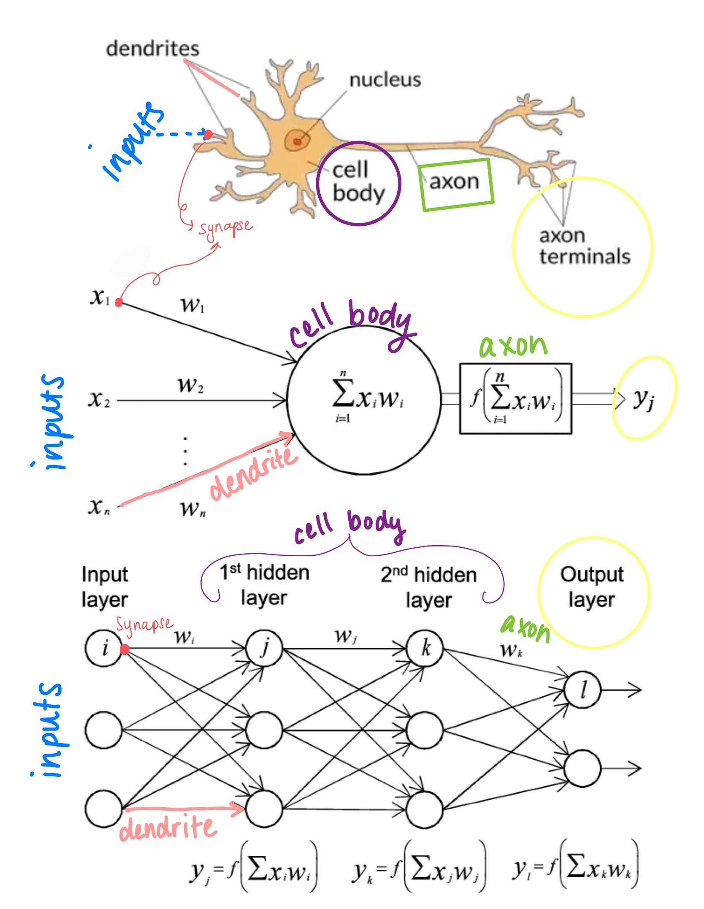
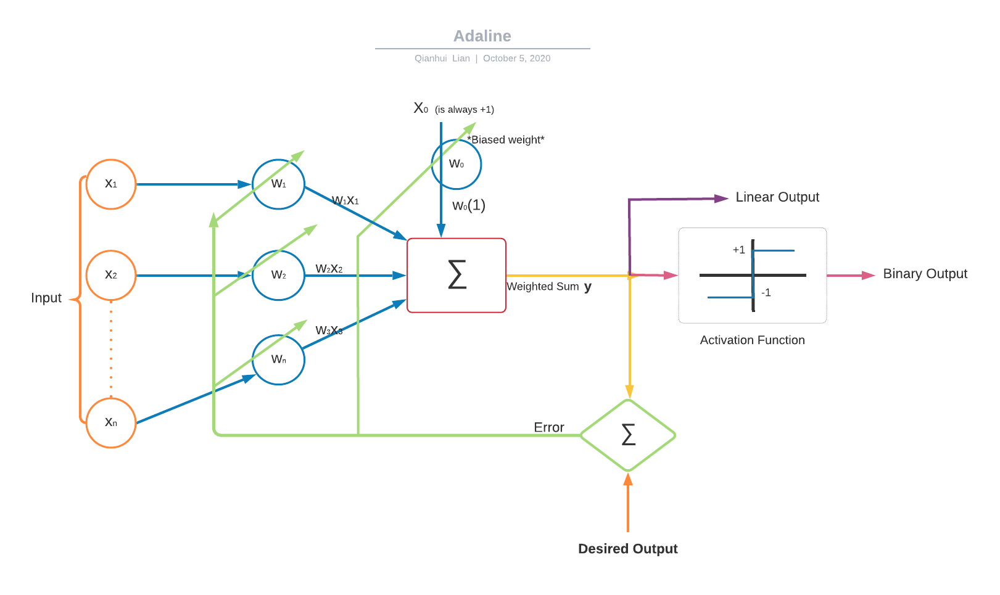
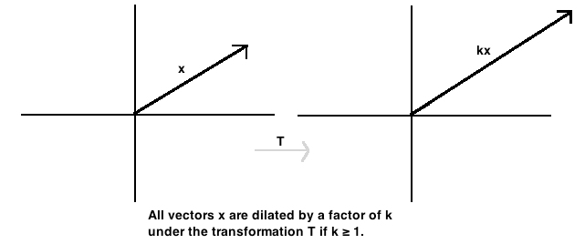

Authors: Matthew Leong, Qianhui Lian, India Lindsay. ([PDF](../../static/b-08-nn.pdf))

## Summary of Lecture

In this lecture, we were introduced to the concept of neural networks. We walked through the similarities between an actual neuron and a neural network. We discussed the very first neural network model, the adaptive linear element. We then focused on how neural networks operate. We finalized by touching on the linear transformations that would occur in a network of linear neurons (neurons which have an identity activation function). In this lecture supplement, we touch on and expand upon each of these four areas.  

### Analogy of a Neuron: 

A neural network is a machine learning approach that models the human brain. In the below image, you can observe the comparison of elements between a neuron, a simple neural net, and a neural net with 2 hidden layers. 

The "synapse" of a neural net is where the input variables are received.

The "dendrite" is where the weights are computed for each input variable. 

The "cell body" is where all the weights are summed up. 

At the start of the "axon", the nonlinear transformation is applied. The "axon" then carries the resulting output to the "axon terminal". 

The "axon terminal" represents the output of the neural net. 

### History of Adaptive Linear Elements: Qianhui

As Dr. Ghosh mentioned in class, ADALINE (ADAptive LINear Element) was created by Bernard Widrow and Ted Hoff in 1959. ADALINE was inspired in attenpts to model the structures of a neuron. We can look at the model without non-linearity as well as tranforming the linear output to a binary output. The linear output would go to the activation function, that transforms the output. 

Note: The transformation by a binary activation function shown below represents whether the neuro is firing or not. Remember the activation funciton can be non-linear functions other than binary step. 

Here is a break down of the model works:

The model takes a set of inputs *x* then multipled them to a set of weights *w* (Note: input(x0) for the bias weight(w0) is always positive 1). These products are added together to generate a weighted sum, we will call this *y* (our output using the given input). To train the model, *y* is comparied to the desired output for the specific input. The difference between them is generates an error value. The model uses this error to adapt the weights. Through this step, the model adjust the weights and find a linear output with a minimized MSE.

This linear output could then transform through an activation function (the image below shows a binary function) to generate an output of 1 or -1.

### Neural Networks

Neural networks are comprised of a D dimensional input layer, an M dimensional hidden layer, and a K dimensional output layer. After the inputs are received, the weights are summed up and then passed through a nonlinear activation function, typically a hyperbolic or sigmoid function. This function serves as a universal approximator. When fed any continuous function and hidden layers, a universal approximator will map the function exactly. In this context, it maps it from D dimensional space to K dimensional space. After the nonlinear activation layer, the neural network again sums up the weights and outputs predictions. 

The universal approximator indicates that a mapping can exist from our inputs to our prediction outputs. However, there are still several design questions that serve as parameters in the neural network: the number of hidden units/nodes, # of epochs/iterations of SGD, the type of activation function, and the learning rate used by SGD. 

### Linear Transformations

In lecture, we touched on the concept of linear transformations. Linear transformations occur within a linear neural network when the activation function is merely the identity activation function. 

 We'd like to elaborate on this concept and some others to help those without a math background. For instance, why do we bother with vector notation and all the linear/matrix algebra? As mentioned earlier, neural networks have input nodes. How do we repesent all these inputs? Well we can write it out as $x_1,x_2,x_3,...x_n$. However, this is quite cumbersome to write out every single time so we can represent it as a vector instead. 

$$ \vec{x} = \begin{bmatrix}
x_1 \\
x_2 \\
x_3 \\
. \\
. \\
x_n \\
\end{bmatrix} $$

Now we can represent our inputs simply as just $\vec{x}$. This keeps the math simple and allows us to do various operations on the vector. For instance, we can do something as simple as multiplying by a number like 2. This would essentially be:

---

$$ 2*\vec{x} = \begin{bmatrix}
2x_1 \\
2x_2 \\
2x_3 \\
. \\
. \\
2x_n \\
\end{bmatrix} $$

This is pretty simple but you might be surprised to learn that it's a linear transformation. More specifically it is a scalar transformation. There is also a visual element towards linear transformations. However, it is hard to visualize n-dimensions so let's consider a 2-d vector which can be represented as:

$$\vec{x} = \begin{bmatrix}
x_1 \\
x_2
\end{bmatrix}$$

If we then multiply by a positive scaling value k, we can represent the linear transformation of scalar multiplication graphically like:

Linear transformations of course aren't just scalars. They can consist of many different things. In fact, we have been using linear transformations even before neural networks! Differentiation is one such linear transformation. If you want more details on what constitutes a linear transformation, I would recommend looking at this wolfram alpha article: https://mathworld.wolfram.com/LinearTransformation.html.

### Supplemental Resources:

Statquest video: https://www.youtube.com/watch?v=CqOfi41LfDw&

3blue1brown video series: https://www.youtube.com/watch?v=aircAruvnKk&list=PLZHQObOWTQDNU6R1_67000Dx_ZCJB-3pi
