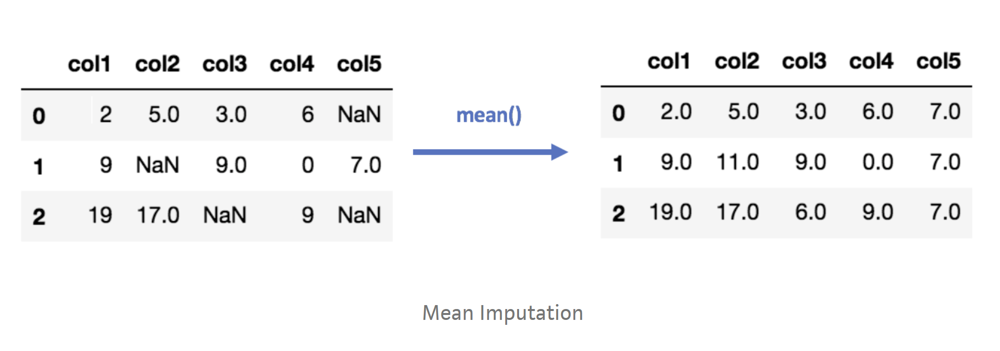
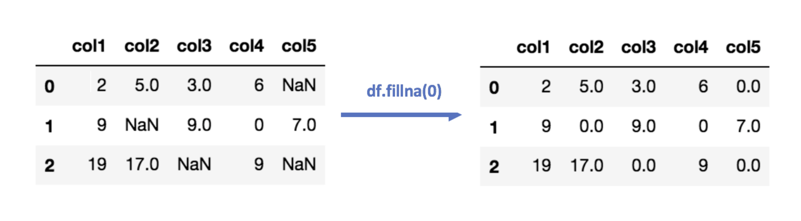

Authors: Kessiena Ofunrein, Brett Nesfeder, Shakirah Oladokun. ([PDF](../../static/b-10-dp.pdf))

In this lecture, we were introduced to data issues and began to expand on pre-processing steps in order to transform the various data collected to make them meaningful and useful. We discussed an overview of pre-processing, the benefits of data cleaning, and possible solutions for missing values.

### Quantity and Quality of data
The amount of data you require depends on the kind of problem you are trying to solve and for the quality you would want to ensure the data you are using is from a reliable source.

When collecting data, deciding what type and how much to obtain will depend in large measure on how the data will be used and the group(s) that will be given the data, as well as the risk-taking or risk-averse position adopted. Among the most important issues involving the quality of data are knowing what plans and activities will lead to obtaining high-quality data and recognizing whether the data obtained achieve one's goals. Factors to consider in deciding on the quality and quantity of data to collect include the following: robustness of data ; potential use of the data; degree of bias that is acceptable; the quantity of data that must be collected in a study or trial which must be considered separately from the quantity to be submitted in a regulatory dossier; practicality of the study; cost of the study; and time available and necessary to complete a research. 

### Before Pre-Processing
Creating single "input" variable visuals as well as bivariate visuals is a good way to know what to expect from the data. Visualizations such as boxplots and scatterplots can allow you to see if there's an obvious column with many missing variables or outliers. A quick couple visuals of your data will prepare you better for the pre-processing process. 

### Why do we clean our data?
This is a very important step that is been carried out after the collection of data. It is also called data cleansing. This is the process of ensuring that your data is correct, consistent and useable by identifying any errors or corruptions in the data, correcting or deleting them, or manually processing them as needed to prevent the error from happening again.

### Benefits of Data Cleaning
Here are several key benefits that come out of the data cleaning process:
1.	It removes major errors and inconsistencies that are inevitable when multiple sources of data are getting pulled into one dataset.
2.	Using tools to cleanup data will make everyone more efficient since they’ll be able to quickly get what they need from the data.
3.	Fewer errors means happier customers and fewer frustrated employees.
4.	The ability to map the different functions and what your data is intended to do and where it is coming from your data.

### 6 Steps to Data Cleaning
To achieve your goals and meet expectations on how your fleet data can benefit you, you must first determine how will you execute data cleanup successfully. A couple of great guidelines to follow is to focus on your top metrics. What is your company’s overall goal and what is each member looking to achieve from it? A good way to start is to get all the interested parties involved and start throwing ideas around.

### Here are some best practices when it comes to creating a data cleaning process:
1. Monitor Errors
Keep a record and look at trends of where most errors are coming from, as this will make it a lot easier to identify fix the incorrect or corrupt data. This is especially important if you are integrating other solutions with your fleet management software, so that errors don’t clog up the work of other departments.
2. Standardize Your Processes
It’s important that you standardize the point of entry and check the importance of it. By standardizing your data process you will ensure a good point of entry and reduce the risk of duplication.
3. Validate Accuracy
Validate the accuracy of your data once you have cleaned your existing database. Research and invest in data tools that allow you to clean your data in real-time. Some tools now even use AI or machine learning to better test for accuracy.
4. Scrub for Duplicate Data
Identify duplicates, since this will help you save time when analyzing data. This can be avoided by researching and investing in different data cleaning tools, as mentioned above, that can analyze raw data in bulk and automate the process for you.
5. Analyze
After your data has been standardized, validated, and scrubbed for duplicates, use third-party sources to append it. Reliable third-party sources can capture information directly from first-party sites, then clean and compile the data to provide more complete information for business intelligence and analytics.
6. Communicate with the Team
Communicate the new standardized cleaning process to your team. Now that you’ve scrubbed down your data, it’s important to keep it clean. This will help you develop and strengthen your customer segmentation and send more targeted information to customers and prospects, so you want to make sure you get your team in line with it.

## Get Your ROI from Data
When you have the task of managing data, keeping on top of consistency and accuracy are two underlying jobs you have to deal with everyday. These steps should help make it easier to create a daily protocol. Once you have completed your data cleaning process, you can confidently move forward using the data for deep, operational insights now that your data is accurate and reliable.
## How do we deal with Missing Values ?
Missing values are a common occurrence, and you need to have a strategy for treating them. A missing value can signify a number of different things in your data. Perhaps the data was not available or not applicable or the event did not happen. It could be that the person who entered the data did not know the right value, or missed filling in. Data mining methods vary in the way they treat missing values. Typically, they ignore the missing values, or exclude any records containing missing values, or replace missing values with the mean, or infer missing values from existing values.		
#### Missing Values Replacement Policies:	
- Ignore the records with missing values.
- Replace them with a global constant (e.g., “?”)
- Replace them with the variable mean (if numerical) or the most frequent value (if categorical)
- Use modeling techniques such as nearest neighbors, Bayes’ rule, decision tree, or EM algorithm

Below is an example of solving the issue of missing values by replacing them with substitued values (imputation). In this case, the missing values are subsituted with the mean of their specific columns. 

This next example shows an example of imputation but instead of replacing the missing values with the mean of the numbers in their column, they are replaced with zeros. 

## Additional Resources 
- Data Cleaning Tutorial in Python https://www.youtube.com/watch?v=ZOX18HfLHGQ
- Handy Python Libraries for Cleaning Data https://mode.com/blog/python-data-cleaning-libraries/
- Pandas and Numpy for Data Cleaning https://realpython.com/python-data-cleaning-numpy-pandas/