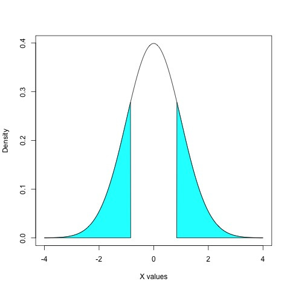
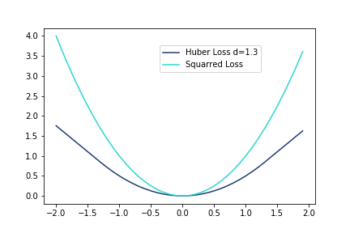

Authors: Zeba Pathan, Deepti Rao, Ryan Rue. ([PDF](../../static/b-11-outliers.pdf))

In this lecture, we were introduced to outliers and methods for dealing with them during analysis. We started off by discussing the subjectivity of outlier identification. Next, we covered methods of handling outliers. Lastly, we learned about the relationship between making a function more robust and how it affects the loss function.

## About Outliers
Outliers are data objects with characteristics that are considerably different than vast majority of other data objects in data set. 

Of the measures of central tendency (mean, median, and mode), the mean is generally most distorted by outliers. However, determining whether a data point is an outlier is subjective. Based on the plane that the data is viewed in, a data point may or may not look like an outlier. Therefore, it can be difficult to determine what exactly is an outlier. However, finding a way to identify outliers is important because outliers occur  a lot in real data.

Generally speaking, there are 3 main causes for these outliers in real data:
1. Data entry or measurement errors
2. Sampling problems or unusual conditions
3. Natural variation

When outliers occur, there are two main ways of dealing with them:
1. Detecting the outliers and throwing them out
2. Modifying your model to be more robust to outliers

We will go over one method for each of the ways of dealing with outliers (trimmed means and Huber Loss) down below.

## Trimmed Means
In order to make the mean more robust to outliers, we can trim the dataset to remove outliers on either side of the distribution. Taking the mean of the trimmed dataset is known as the trimmed mean. This can provide more accurate statistics on the vast majority of the data.

 

The benefit of trimming means are that it is an easy fix for normalizing a skewed distribution. However, it is not always practical to use this method, especially when a large number of outliers exist. 

As an example, in judging diving competitions at the Olympics, the highest and lowest scores are thrown out in order to get a more fair score for each competitor by hedging against potential outlying scores. However, this can be problematic if 2 judges collude to skew the scores in a certain direction because this method of trimming may not get rid of all outliers.

## Huber Loss
The Huber Loss function is unique in that it combines both MSE and MAE to create a robust loss function against outliers. The Huber loss is similar to MSE (or a quadratic function) for small residual values in the data set and changes to MAE (or a linear function) for large residuals values.

By taking the mean of the huber losses for each point in our data set, we can create our loss function. Huber loss is smooth unlike the MAE and increases at a linear rate as shown in the image below. 

The Huber Loss function, unlike the squared loss function, makes each data point not cost as much so that the outlier does not affect the model as heavily. In short, Huber Loss does not react so violently to outliers, making it robust towards them.

One of the drawbacks of Huber Loss is that is can be difficult to determine the transitions point between the quadratic and linear portions of the function. Additionally, this loss function is tedious and quite complicated to perform.

## Additional Resources
- Trimmed Means https://garstats.wordpress.com/2017/11/28/trimmed-means/
- Huber Loss https://medium.com/@gobiviswaml/huber-error-loss-functions-3f2ac015cd45
- Another Huber Loss https://www.textbook.ds100.org/ch/10/modeling_abs_huber.html
- Guidelines for Removing and Handling Outliers in Data https://statisticsbyjim.com/basics/remove-outliers/
