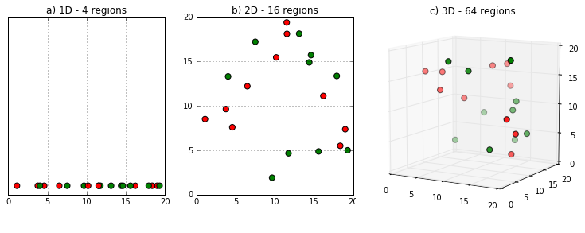
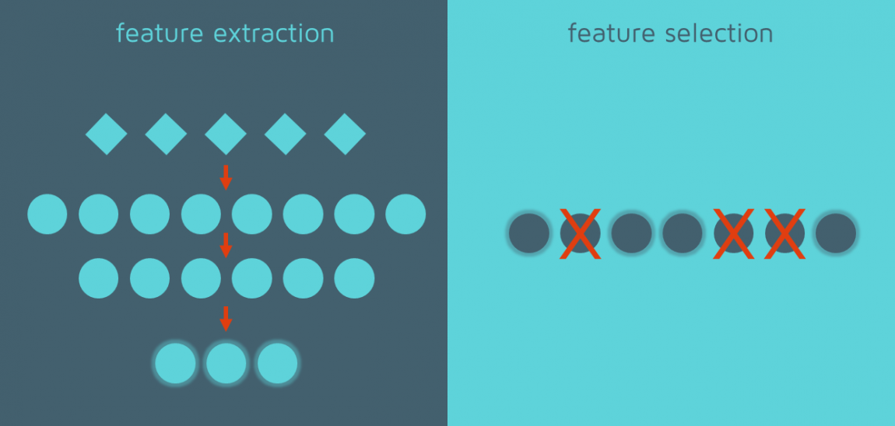

---
title: All About Features
--- 

Authors: Matthew Ruffner, Ali Daanesh Sayyed, Paridhi Sheth. ([PDF](../../static/b-12-reducing-features.pdf))

### Summary

The lecture covered the concepts of curse of  dimensionality, feature extraction, selection and selecting a subset of features. Curse of dimensionality is the phenomena that arises when analyzing and organizing data in high dimensional spaces. Feature extraction is the process of dimensionality reduction by which an initial set of raw data is reduced to manageable groups for processing, leading to an increase in model accuracy. Moreover feature selection is the process of selecting features that contribute to the variable one is predicting. Lastly selecting a subset of features is the process of selecting the best combination of features for a model.

### Curse of Dimensionality

As the number of features or dimensions grows, the amount of data we need to generalize accurately grows exponentially - the more the features, the more the data. The dimensions can be increased 10^d which increases the data that many folds and decreases the accuracy. For example: figure a) shows 10 data points in 1-D meaning there is only one feature in the dataset. It can easily be illustrated on a line with only 10 values (x=1,2,3,4...10). But, if we add one more feature, the same data will be illustrated in 2-D represented in figure b) leading to an increase in dimension space 10^2=100. Lastly, for figure c) dimension space increases 10^3=1000. As dimension grows, dimension space increases exponentially. 

This exponential growth in data causes high sparsity in the data set and unnecessarily increases storage space and processing time for the particular modelling algorithm. For example, in image recognition there is a problem of high resolution images 1280 × 720 = 921,600 pixels i.e. 921600 dimensions. This is called the curse of dimensionality. 

**Problems with high dimensional data:**
1. Increases the processing time
2. Over fitting
3. Required data size increases exponentially
4. Principal Component Analysis is one of the common methods used to reduce the dimensionality. The idea behind PCA is to find out dimensions which account for most of the variance within data.

**Advantages of Dimensionality Reduction:**
1. Computational Efficiency
2. Cost associated with collection and storage of huge data
3. Classification problem
4. Ease of interpretation

**References:**
1. https://www.youtube.com/watch?v=OyPcbeiwps8 
2. https://www.kdnuggets.com/2017/04/must-know-curse-dimensionality.html
3. https://www.fromthegenesis.com/curse-of-dimensionality/

### Feature extraction

An analogy for feature extraction I found online is that models are like the motor of a car, and features are like the fuel. One needs to find features that represent the information in the data that will best fit the needs of the algorithm that is to be used in a model. Feature extraction reformats, combines, and transforms primary features into new ones in order to create a model that will achieve a desired goal.

Nowadays it is common to work with datasets that contain hundreds or even thousands of features, which is something to keep in mind when creating models, especially for cases where the amount of features are greater than the number of observations. Having such datasets can lead to models that suffer from overfitting. As data scientists we want to avoid our models from being affected from such errors, hence the concept of feature extraction. Feature extraction allows data scientists to avoid the problem mentioned above by reducing the number of dimensions used within the model creation process. 

Feature extraction techniques are advantageous, and can help improve the accuracy of a model, reduce the risk of overfitting, speed up the training, improve the data visualization, as well as increase the explainability of a model. 

The goal of feature extraction is to reduce the number of features in a dataset by creating new features from existing ones (while removing original features). These new features should summarize the information from the original features while discarding any information that appears less important. 

**References:**
1. https://towardsdatascience.com/feature-extraction-techniques-d619b56e31be
2. https://quantdare.com/what-is-the-difference-between-feature-extraction-and-feature-selection/

### Feature selection 

When one considers training a model there are various preprocessing steps that must be taken in order to arrive at an accurate, interpretable model. One such step is reducing unnecessary data from our original dataset which does not only simplify model creation but can actually even improve the said model’s accuracy as well as boost speed of computation.  Feature selection is a data reduction technique that pertains to choosing a subset of the original features thereby reducing the number of predictors. A subset of features can be derived from the original dataset by introducing a ‘selector matrix’ (also called a filter) consisting of ones and zeros and multiplying by the original features in vector form. 

Selecting a subset of features 
Selecting the best combination of features is classified as an np.hard problem (essentially just an insanely hard nondeterministic polynomial time problem that requires vast amounts of computing power to solve). So, when deciding which subset of features to use, we do so using heuristics which allow for an easier/ simpler solution but not necessarily the optimal one. There are a few ways to go about this, one possibility would be to use a filter method wherein intrinsic quality measures are compared such as the correlation between predictors (in this situation, if the predictors are strongly positively correlated, then one or many of the predictors may not be contributing as much to the seen variance in the model and can be eliminated). Another possibility are wrappers, an extrinsic evaluation technique such as greedy (only making use of some features)  evaluation of a predictive model e.g. a decision tree with a restricted depth. Other wrappers include stepwise and backward elimination (note: backward is generally less applicable than forward for large datasets because computing limitations) which either incrementally add or remove  variables from a model to optimize accuracy. Finally, there are embedded methods, wherein feature selection is naturally part of a model such as a LASSO model which adds a penalty to forcefully make coefficients equal to zero for large enough lambda.

**References:**
1. https://towardsdatascience.com/feature-selection-techniques-1bfab5fe0784
