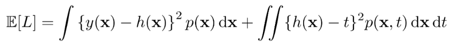
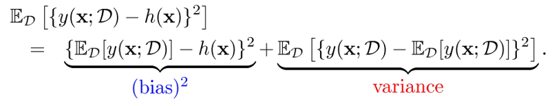
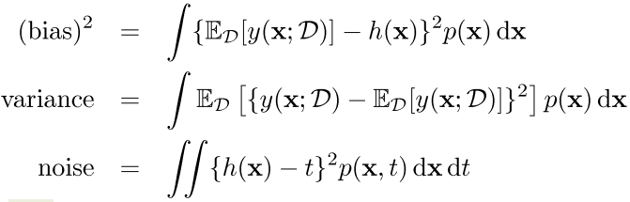
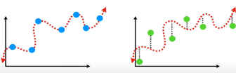
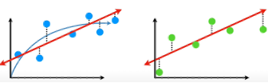
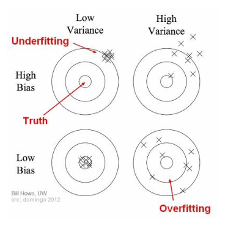
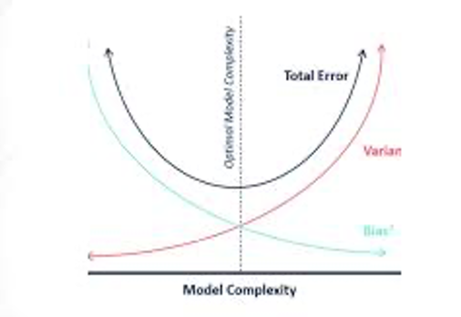
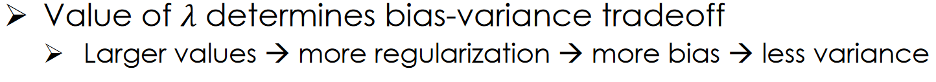

Authors: Zachary Hall, Mac Husted, Nicole Jiang

Expected square loss (E[L]) formula:

- t: target value (random variable) → Assume: t = h (x) + zero - mean noise
- x: input value (random variable)
- h(x): target line
- y(x): predicted line

The first term of the expected square loss is bias and variance. It is the difference between the predicted line and the target line. This first term is composed of bias^2 + variance.

The second term of the expected square loss represents the variance of the error term. It shows the difference between target line and the target points.

## Math Details: The Bias-Variance Decomposition (optional)

In order to minimize the expected test error, we need to select a statistical learning method that simultaneously achieves _low variance_ and _low bias_.

Expected loss = (bias)^2 + variance + noise

**Variance** : how sensitive the model is to variations in data.

Variance refers to the amount by which ˆ_f_ would change if we estimated it using a different data set (training dataset &amp; testing dataset).

In general, more flexible statistical methods have higher variance.

**Bias** : how good the average model is;

Bias refers to the error that is introduced by approximating a real-life problem, which may be extremely complicated, by a much simpler model.

Generally, more flexible methods result in less bias.

\*\* the bias and variance concepts here apply to a predictive model, rather than to an estimator of a specific value.

# Bias-Variance Tradeoff

When a model is too simple and has very few parameters then it may have high bias and low variance. While, if a model is too complex and has too many parameters then it&#39;s going to have too much variance and low bias. The optimal model is one where the level of complexity leads equivalent reduction in variance and increase in bias.

If our model complexity exceeds this optimal spot, the model will be in effect over-fit. On the other hand, if the model is too simple, the model will be under-fit . Thus, one has to ensure that they balance the complexity of the model that will provide the reduction in both bias and variance.

# How does one improve their model?

The first method to improve one&#39;s model is to get more training data. This will reduce the variance of one&#39;s estimates while keeping the bias overall the same. It also has an additional benefit of allowing one to increase their model complexity. The more training data one has the more likely that training error and the test error will converge. Since the test error is an unbiased estimate of the true mean, the model will be closer to the &quot;true&quot; error.

The second method is to change the complexity of the model via regularization. Through regularization, one can find the optimal complexity that will reduce the bias and variance allowing one to improve their model&#39;s overall fit.

The third method is to change the optimization method. Through cross validation and regularization one can also optimize the parameters of the model which will also improve the overall fit of the model.

The last method is to change the model type. There are times when a linear model may not provide the most optimal solution. Sometimes one might change the model type to a nonlinear model which may improve the overall fit of the model.

If these methods don&#39;t improve the overall solution, one might need to do feature engineering. This involved careful selection and possible manipulation of the data features. The reason to do this is to feed the model only the most optimal inputs. If one can consistently give the model only part of the data it needs to make more accurate predictions then it doesn&#39;t have to deal with any extra noise that comes from the rest of data. It also allows one to reduce the possibility that the model is suffering from the collinearity problem. An alternative way of selecting features may be through principal component analysis for example.

# The Effect of Regularization on Bias and Variance

When one regularizes a model, they are penalizing model complexity with the goal of reducing the variance and bias to an optimal level. When there is more regularization (i.e. higher lambda or alpha), there is more bias and less variance. When one regularizes a model, they must keep this in mind to ensure that they haven&#39;t regularized the model too much where more bias is being introduced. This goes back to the idea of the bias-variance trade-off. When we keep this mind when regularizing, the model should make more reliable predictions on future data sets other than just the training dataset.

# Additional Information &amp; Resources

## Irreducible error

Variability associated with error terms also affects the accuracy of our predictions. This is known as the _ **irreducible** _ error, because no matter how well we estimate _f_, we cannot reduce the error introduced by the error terms.

**Why is the irreducible error larger than zero?**

The quantity may contain **unmeasured variables** that are useful in predicting _Y_ : since we don&#39;t measure them, _f_ cannot use them for its prediction.

The quantity may also contain **unmeasurable variation**. For example, the risk of an adverse reaction for a given patient on a given day.

## Resources

[An article on bias-variance trade-off]([https://towardsdatascience.com/understanding-the-bias-variance-tradeoff-165e6942b229)

[An article on improving one&#39;s model](https://towardsdatascience.com/3-ways-to-improve-your-machine-learning-results-without-more-data-f2f0fe78976e)

[An article on regularization and bias and variance](http://www.ds100.org/sp18/assets/lectures/lec17/17-bias-variance-regularization.pdf)